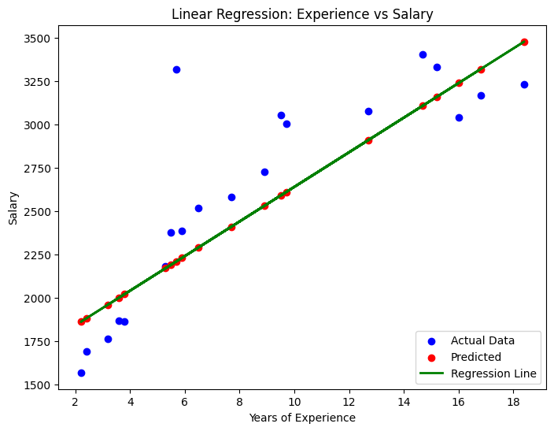
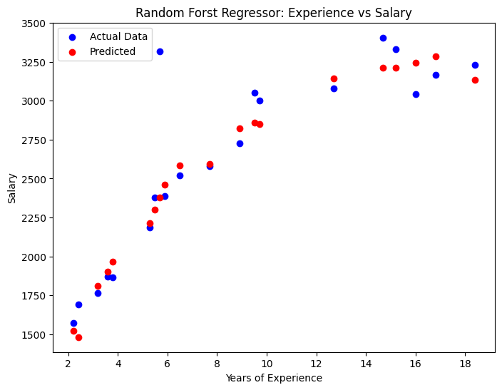

# Salary Prediction using Linear Regression & Random Forest

 
 


## Description
This project aims to predict salary based on the amount of work experience using **Linear Regression (LR)** and **Random Forest Regressor (RF)** methods. The model is trained using a dataset containing information about work experience and salary.

## 📊 Dataset
The dataset used has the columns:
- `experience_years` → Years of work experience
- `salary` → Salary

## 🔧 Installation
Make sure Python and the following libraries are installed:
``bash
pip install pandas numpy seaborn matplotlib scikit-learn


---

### **📈 Visualization Results**
Below are the results of salary predictions using both Linear Regression and Random Forest Regressor:

### Linear Regression Result
Predicted salaries vs actual salaries using a simple linear regression model


### Random Forest Result
Predicted salaries vs actual salaries using a simple Random Forest model

   ```python
